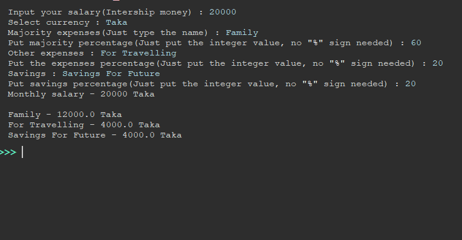

# Budget Calculator

## What it is:
  ### The Budget Calculator here calculates the monthly budget of a person. By using budget calcualtor one can organize their budget smartly. 
## How to use it:
  ### To use this calculator, first run the program in Python. Then input monthly wage. After that, input majority expenses, other expenses and savings. User can name these fields with their liking. But must be careful on managing the percentages. Percentages must add up to 100. 

  Example:
  
